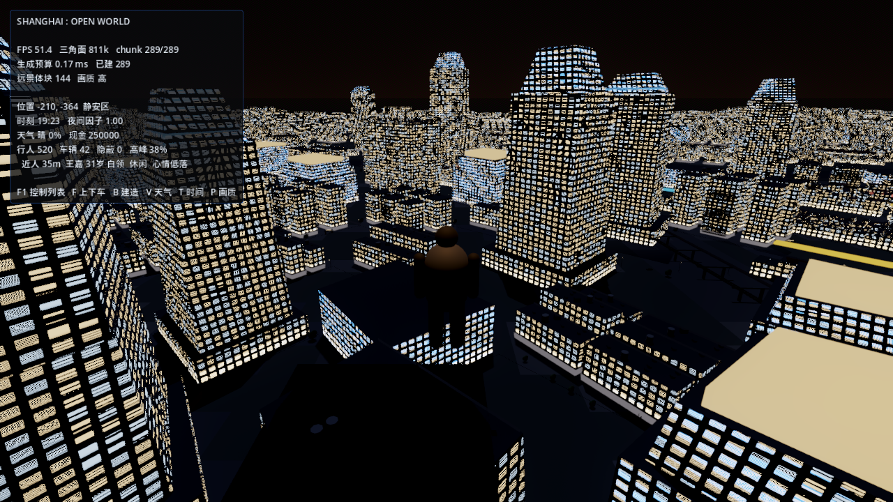
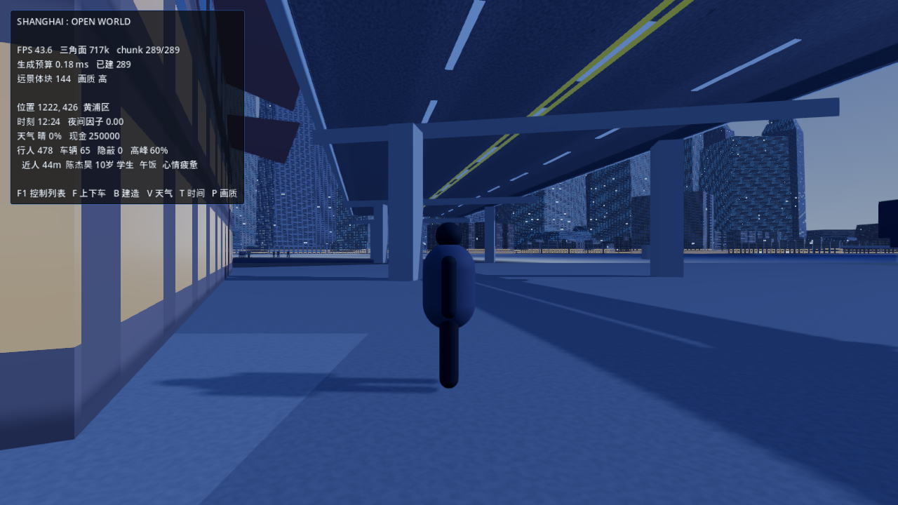
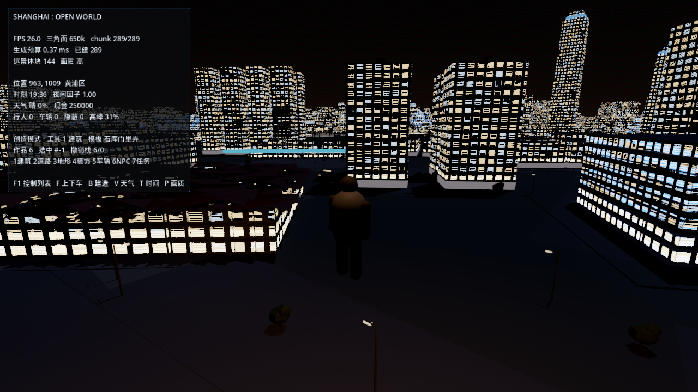

# SHANGHAI: OPEN WORLD

一个以上海城市空间逻辑为原型的**可运行开放世界原型**：程序化生成的 12 km × 12 km 城市、
黄浦江、23 处地标、昼夜与天气、职业驱动的人群与车流，以及玩家可以改变城市的创造模式。

**状态：0.x 可运行原型（Vertical Slice）。** 不是完整游戏，也不是概念演示——
下面每一条"已实现"都有可复现的运行命令与实测数据支撑。

> ⚠️ **引擎说明：这是 Godot 4.4.1 工程，不是 UE5。**
> 原始设计文档以 UE5 + C++ 书写，但目标环境无 UE5 安装、磁盘也不足以容纳引擎与城市工程。
> 设计文档自身要求"优先保证项目真正可运行、不得伪装已完成"，
> 因此这里用 Godot 实现了同一套系统，并逐项记录了 UE5 技术的替代方案：
> 见 [Docs/KNOWN_ISSUES.md 第 1 条](Docs/KNOWN_ISSUES.md)。

---

## 城市

夜景天际线，相机高度 120 m，位于静安区上空：



街景，延安高架路下方，12:24：



## 创造模式

按 `B` 进入：世界暂停、光标释放、点击放置。玩家作品与程序化城市**共用同一套生成器**，
所以窗格、檐口、夜景发光与周边建筑同源，不需要第二套渲染路径或任何美术资产：



---

## 城市是活的

城市经济由一个区级协调器 `CitySim` 持有：家庭、商业、房东三个现金桶之间只做**配对转移**，
商铺按自己的盈亏开关店，而**街上的人数与车数是这套状态的下游**。所以下面这些不是并行播放的
动画，是同一件事的两端：

```
[sim] day 1 hour 13 wet=0.00 shops=12212 jobs=69407 crowd_f=0.95 car_f=1.00 agents=453 vehicles=55
[sim] day 1 hour 13 wet=0.81 shops=12212 jobs=69407 crowd_f=0.95 car_f=1.35 agents=453 vehicles=74
```

同一时刻下了雨：出行需求上升 → 车辆系数 1.00→1.35 → 街上从 55 辆变成 74 辆。
玩家关掉一间铺子会减少就业，就业减少会压低下一小时的消费，消费不足会让别的铺子亏本关门。

经济部分由 25 条断言 + 一次模拟一整年的浸泡测试守着，验证的是"钱一分不多一分不少""同种子
逐位可重放""跑一个月就业上升而不是塌缩""产能收紧必须涨价、产能过剩必须跌价"。
它**仍是区级抽象**，不是个体模拟——边界老实写在 `Docs/KNOWN_ISSUES.md` 第 5b 条。

## 已实现 / 未实现

按实际运行结果分类，不标注"应该可以工作"的部分。

| 系统 | 状态 | 依据 |
|---|---|---|
| 城市地图：环线 + 放射干道 + 对偶格网街区 + 12 种街区原型 | ✅ 已实现 | `--census` 普查：cells=8182 plates=7316 edges=10529 |
| 黄浦江 / 苏州河 / 河岸地形 / 流式加载 / LOD | ✅ 已实现 | 289/289 chunk 全部生成，`freed=0`（无卸载-重建抖动） |
| 23 处地标（陆家嘴四件套、外滩万国建筑群、4 座桥等） | ✅ 已实现 | 含夜景发光签名 |
| 第三人称角色 + 光线投射车辆物理 | ✅ 已实现 | 稳态 45–55 FPS |
| 人群与车流（14 种职业、作息、通勤、心情） | ✅ 已实现 | 行人 478 / 车辆 65，HUD 显示姓名·年龄·职业·状态 |
| 昼夜循环 | ✅ 已实现 | 12:24 / 19:18 / 22:00 三组截图 |
| 天气（晴/多云/阴/雨/暴雨/雾/台风） | 🟡 部分实现 | GPU 粒子降水 + 着色器湿滑/雾密度；**无**车窗雨滴、路面积水 |
| 创造系统：放置/移动/旋转/缩放/复制/删除/撤销/重做/存盘/读盘 | ✅ 已实现 | `--create-test` 22 项断言全通过 |
| 创造工具：建筑（12 种模板） | ✅ 已实现 | 见上方截图 |
| 创造工具：道路（两点成段，含车道/人行道/路缘/路灯） | ✅ 已实现 | `--validate-test` 24 项断言全通过 |
| 放置合法性校验（越界/水面/滩地/公园/干道/已有建筑/作品重叠） | ✅ 已实现 | 七类拒绝理由各有独立断言 |
| 创造工具：地形 / 装饰 / 车辆 / NPC / 任务 | ❌ 未实现 | 按键 3–7 只提示"待实现"，不产生世界修改 |
| 3D 拖拽 Gizmo | ❌ 未实现 | 改用键盘变换（方向键 / R / [ ] / Ctrl+D） |
| 城市经济：区级三桶现金闭环、商铺盈亏开关店、就业为商铺的折叠、自适应价格 | ✅ 已实现 | `--sim-test` 25 项断言；`--sim-soak=8760`（模拟一年）钱守恒且**不塌缩** |
| 经济 ↔ 被渲染世界的联动（行人密度、车辆数读区级状态） | ✅ 已实现 | 断言 `人群/交通系统接入了城市模拟`；实时雨天 74 辆 vs 晴天 55 辆 |
| 玩家行为改变城市（开店/关店 → 就业 → 消费） | ✅ 已实现 | 断言 `玩家开店确实增加了就业` |
| 模拟状态持久化到后端 | ❌ 未实现 | `snapshot()/restore()` 只在内存，重启回播种态 |
| 交通：红绿灯、行人让行、道路图容量 | ❌ 未实现 | 车辆走隐式格网，边无容量、路口无通行权 |
| 公共交通 / 地铁 | ❌ 未实现 | 公交车只是车辆外观之一，无线路与站点 |
| NPC 个体经济身份、社会关系、长期记忆、动态任务 | ❌ 未实现 | 经济是区级桶，个体只被聚合系数影响 |
| 建筑室内、任务编辑器、创意工坊前端、多人、AI 生成 | ❌ 未实现 | 均依赖尚未存在的最小可运行闭环 |

## 实测数据

```
1280×720 / 1600×900，Quality=高，RTX 5060 Laptop

chunks=289/289        三角面=717k        稳态 FPS=45–55     加载期 FPS=15–29
单 chunk 构建 = 17.7 ms（5 样本中位数，17.6–18.1；blocks 8.6 / ground 8.0 / streets 0.9 / furniture 0.4）
流式：built=289  freed=0  requeue=6  jumps=1

人口普查：homes=5822  retail=756  parks=463  total_pop=3,679,892
城市模拟：11 个区域  商铺 12,212  就业 69,407  货币 199,428,337,660 分（整分记账）
模拟一年浸泡：8,760 小时 / 2.75 s 真实时间 / 每小时 0.313 ms
              商铺 12,212→73,774   就业 69,407→433,076   钱一分不差
街区构成：XIAOQU 1842 / DENSE_WALKUP 1359 / VILLAS 1094 / FACTORY 965 /
          SPLIT_TOWER 709 / PARKING 474 / PARK_CELL 333 / MALL 393 /
          SHOPFRONT_ROW 347 / LILONG 266 / SITE 226 / OFFICE_PLINTH 174
```

规模：**33 个 GDScript / 9098 行 + 4 个着色器 + 622 行零依赖 Node 后端，零二进制资产。**
城市、建筑、地标、材质、人群、经济全部由代码与着色器生成，仓库内没有任何模型、贴图或音频文件。

## 运行

需要 [Godot 4.4.1 stable](https://godotengine.org/download/archive/)（Forward+ / Vulkan）。

```bash
godot --path .              # 直接运行
godot --editor --path .     # 在编辑器中打开
```

无窗口验证（CI 友好，全部为只读检查）：

```bash
godot --headless --path . --quit-after 60  -- --census        # 世界普查
godot --headless --path . --quit-after 120 -- --create-test   # 创造系统 22 项断言
```

命令行截图与分相性能计时（用于视觉回归）：

```bash
godot --path . --resolution 1280x720 -- \
  "--shots=2" "--shot-every=11" "--shot-dir=<绝对路径>" \
  "--time=10.0" "--spawn=1150,300"
# 其他：--weather=<0..6>  --quality=<0..3>  --view=<pitch,yaw,lift>  --demo-build=<n>
```

## 控制

`WASD` 移动 · `Shift` 疾跑 · `空格` 跳跃 · `C` 一/三人称 · `F` 上下车 ·
`V` 切换天气 · `T` 推进时间 · `P` 画质档位 · `F1` 帮助

创造模式（`B`）：`左键` 放置/选中 · `Ctrl+左键` 删除 · `方向键` 移动 · `R` 旋转 ·
`[ ]` 缩放 · `Ctrl+D` 复制 · `Del` 删除 · `Ctrl+Z/Y` 撤销/重做 · `Tab` 换模板 ·
`E` 存盘 · `Q` 退出

## 架构

```
src/
  core/       GameGlobals（事件总线 / 输入映射 / 世界常量 / 哈希噪声）
              Assets（材质工厂 / 图元工厂）  QualityPresets（4 档画质）
  city/       CityData     上海空间模型：水系 / 路网 / 区划 / 地标 / 公园 + 量化查询缓存
              Lattice      对偶格网：街区多边形、街道边、邻接
              CellProgram  12 种街区原型的建筑生成
              ChunkBuilder 单个 250 m chunk → 合并网格 + 碰撞
              WorldStreamer 流式加载 / 时间预算 / LOD / 碰撞分层
              MajorRoads   环线与高架：桥、隧道、匝道、路灯
              Landmarks    地标工厂（东方明珠 / 上海中心 / 环球金融中心 / 金茂 / 外滩…）
              MeshFusion   顶点合并器（一个 chunk 一次 draw call 画出全部窗格）
  npc/        OccupationTable / NPCProfile / PopulationSystem / CrowdSystem
  vehicle/    Car / TrafficSystem
  weather/    TimeWeatherRig / WeatherSystem
  creation/   BuildTemplates（模板目录）/ CreationSystem（编辑状态机 + 撤销 + 持久化）
```

设计原则：所有生成读取同一组**纯查询函数**（`CityData` / `Lattice`），
而不是各自维护列表。因此"某个点属于哪个街区""这里离水多近"在网格、交通、人群、
小地图之间不可能漂移，chunk 之间也不会出现接缝。

## 开发流水线

`Pipeline/run.sh` 是一条命令跑完的验收链：
**解析 → 无头启动 → 功能自测 → 世界普查 → 性能与压力 → 静态审查 → 生成看板**。

```bash
bash Pipeline/run.sh              # 全部门禁（需本机 Godot，用 GODOT=<path> 覆盖）
bash Pipeline/review.sh           # 只跑静态审查
bash Pipeline/check_msg.sh <m.json>   # 校验一份 AI 交接消息
```

数值门槛集中在 `Pipeline/gates.sh` 一处——**不允许通过改门槛制造通过**，
调整必须在提交信息里写明前后数值与原因。

`Docs/PROJECT_DASHBOARD.md` 由上一次运行的日志生成，每个百分比都有真实分母
（断言通过数 / 门禁数 / 已实现工具数 / 流式 chunk 数），不手工填写。

AI 协作的角色契约与交接格式见
[`AI_Agents/manifest.json`](AI_Agents/manifest.json) 与
[`AI_COMMUNICATION_PROTOCOL.md`](AI_COMMUNICATION_PROTOCOL.md)。
需要说清楚的是：**这里没有常驻 AI 进程**，也没有会自己写代码的守护服务——
清单是可被机器校验的交接契约，不是自治系统的伪装。

缺陷一律走 [`Bugs/LEDGER.md`](Bugs/LEDGER.md)，每条 `red` 都有可重跑的复现命令；
已修的 `green` 必须有守住它的断言。

## 已知问题与未达成的目标

当前**没有达到**规范要求的 7 ms/chunk 流式预算（实测 17.9 ms），
这是 `Bugs/LEDGER.md` 的 BUG-002，也是性能阶段判"部分实现"的唯一原因。
完整清单见 **[Docs/KNOWN_ISSUES.md](Docs/KNOWN_ISSUES.md)**，其中包含：

- 为消除该缺口试过并被**回退**的方案（50 m 远景地面网格省 4.5 ms，但产生跨 chunk 裂缝）
- 量化副作用：距离场走 25 m 缓存格，岸边判定可偏移至多 25 m（哪些调用点因此走精确路径）
- 桥 underside 可见车道标线（已定位，未修）

[Docs/PROJECT_STATUS.md](Docs/PROJECT_STATUS.md) 记录阶段进度、实测数字，
以及**由运行结果（而非静态阅读）发现的缺陷及其根因**——其中包括一个曾让整座城市
按离原点距离成比例渲染位移的缺陷。


## 素材与版权

- 不含任何第三方受版权保护的游戏资产、角色模型、车辆模型、音乐或贴图。
- 全部几何体、材质、着色器、人群行为由本仓库代码程序化生成。
- 地标为**受其结构特征与视觉关系启发的原创体量**，非授权复制的真实建筑模型。
- 城市关系（路网走向、区划比例、江与两岸、密度梯度、天际线）按真实上海校准，
  但这是程序化近似，不是测绘数据。
- **本仓库当前未附带 LICENSE 文件**，因此在法律上默认保留所有权利。
  若需授权他人使用，请由作者明确选择并添加许可证。
